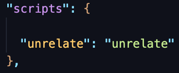
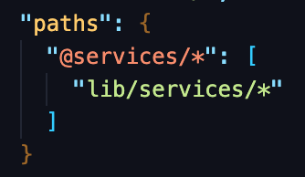

# Unrelate (TypeScript)

[](https://travis-ci.org/lloydaf/unrelate)


This library is used to transform relative paths into absolute paths for [TypeScript](https://www.typescriptlang.org) projects. **You should have a [tsconfig.json](https://www.typescriptlang.org/docs/handbook/tsconfig-json.html) file present in the directory where you run this tool.**

## Usage

### As a global package

You can install it as a global [npm](https://www.npmjs.com) package using the following bash command.

```bash
npm install -g unrelate
```

---

### As a devDependency

If you would rather install it as a [devDependency](https://docs.npmjs.com/specifying-dependencies-and-devdependencies-in-a-package-json-file) instead, you can do that as well.

```bash
npm install --save-dev unrelate
```

After installation, you would have to add `unrelate` to the scripts section of your [package.json](https://nodejs.org/en/knowledge/getting-started/npm/what-is-the-file-package-json) file.



If you've installed it as a `devDependency`, to use `unrelate`, you have to use the following command.

```bash
npm run unrelate <command>
```

---

### Without installing (using npx)

If you'd rather not install it at all, you can simply use [npx](https://medium.com/@maybekatz/introducing-npx-an-npm-package-runner-55f7d4bd282b) to run `unrelate` using the following command.

```bash
npx unrelate <command>
```

## Base URL

Before you start using `unrelate`, you have to configure the [baseUrl](https://www.typescriptlang.org/docs/handbook/module-resolution.html#base-url) property in your `tsconfig.json` file. It informs the compiler where to find modules. All absolute import paths you configure using `unrelate`, are always relative to the `baseUrl`. So set the property to the folder that contains, or contains subfolders that contains all the `.ts` files that would use the absolute imports. It's common to set `baseUrl` to the project root folder or the `src` or `lib` folders, depending on where most of your code lies.

### Configuration

You can either add it manually in your `tsconfig.json` file, or let `unrelate` do it for you.

```bash
unrelate configure base-url <your value here>
```

If you want to set it to the current directory (project root), you can use the following command.

```bash
unrelate configure base-url ./
```

## Paths

After setting your Base URL, you can now configure your absolute paths to import from.

### Configuration

You can add paths using the following command.

```bash
unrelate configure add-path <your path here>
```

For example, if you want to create an absolute path for `lib/services`, you can use the following command.

```bash
unrelate configure add-path lib/services
```

Once that's done, you should be able to see an entry like



in your `tsconfig.json` file. You can now import from `'@services'` in your `.ts` files!

(Note that paths are always relative to Base URL. So if your `baseUrl` value is `src`, and you are adding an absolute path for `src/app/components`, the value for `@components/*` will show up as `app/components/*`, not `src/app/components/*`)

(Also note that if setting paths should be after you set your Base URL. If you change your Base URL after adding paths, your paths will not automatically reflect that change)

## Cleanup

The cleanup tool can save you time, by cleaning up files that have relative imports, and change them to absolute imports, depending on what paths you have configured in the previous step.

To cleanup a file, use the following

```bash
unrelate cleanup path/to/file.ts
```

For example, if you want to cleanup `./src/app/components/component.ts`, use the following command.

```bash
unrelate cleanup ./src/app/components/component.ts
```

Once you run this command, you should see that the file now uses absolute imports instead of relative ones wherever possible.

## Contributing

Please feel free to raise a PR if you want to contribute.
